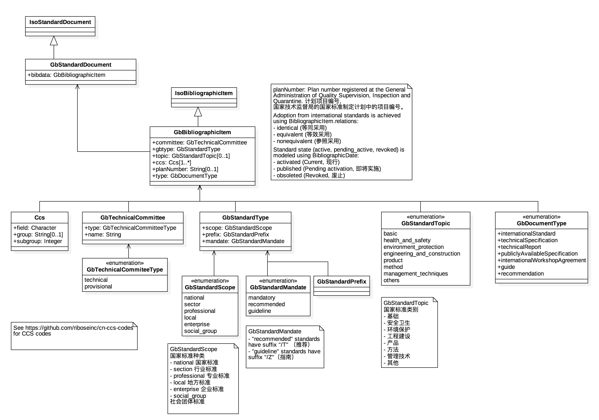
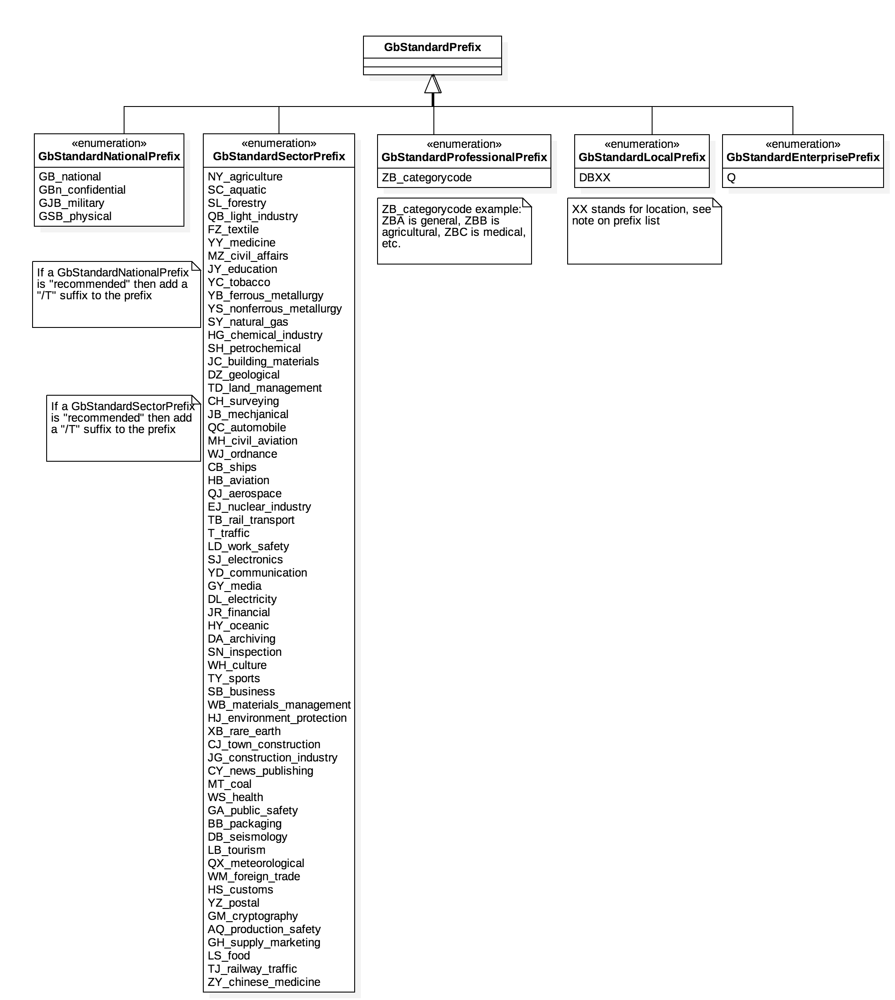

= GbDoc Models

This is where we keep the GbDoc model definitions.

The GbDoc format is an instance of the
https://github.com/riboseinc/isodoc-models[IsoDoc model].

Details of the parent model can be found on its page.

== GbDoc Model

== GbStandardPrefix

== GB Standard Document cover page elements

image::images/gb-standard-coverpage-elements.png[]
