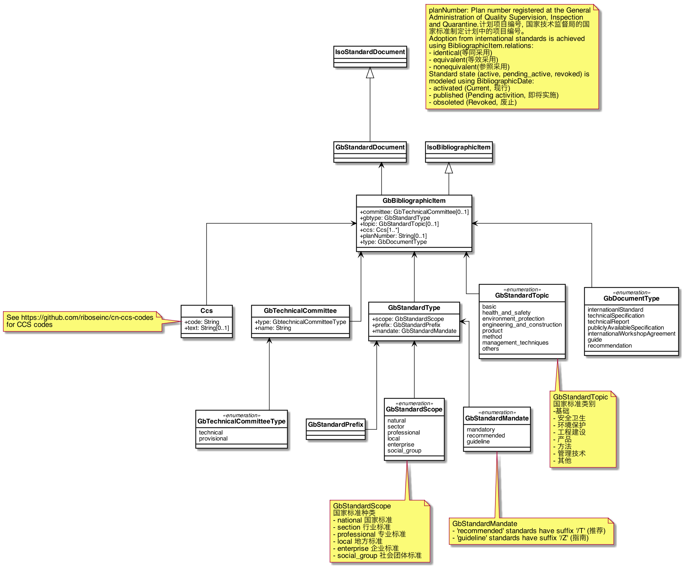
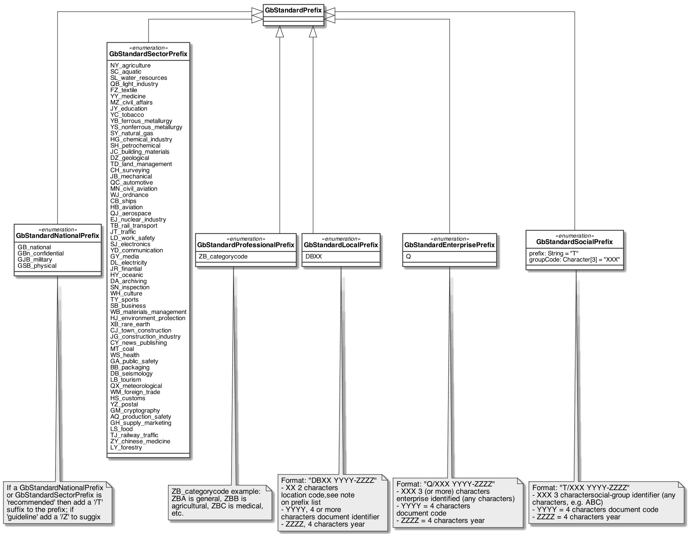
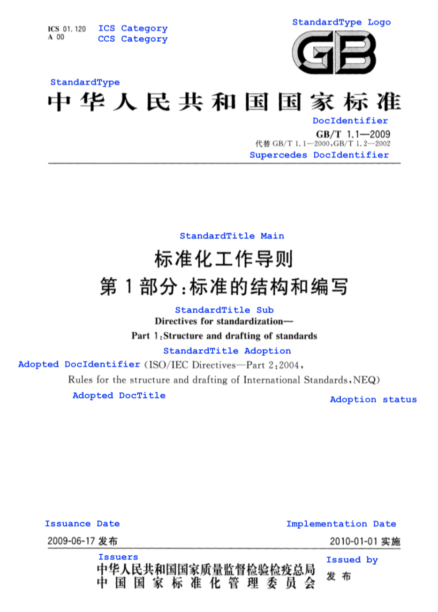

= Metanorma GbDoc Models

This is where we keep the Metanorma GbDoc model definitions.

The GbDoc format is an instance of the
https://github.com/metanorma/isodoc-models[Metanorma IsoDoc model].

Details of the parent model can be found on its page.

== GbDoc Models

== GbStandardPrefix Model

== GB Standard Document cover page elements

